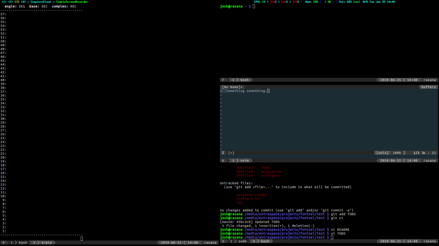

# XMonad-JUtil

## EasyNav

Focus and move mouse to a window using a key binding and a single label key.



To use, import `XMonad.Actions.EasyNav` and add a keybinding, e.g.

```
, ((modm, xK_a), easynav def)
```

Configuration options are:

* *font* Font string (e.g. "-misc-fixed-*-*-*-*-40-*-*-*-*-*-*-*" or "xft:Cousine:size=96").
* *fg* Foreground color (string).
* *bg* Background color (string).
* *identifiers* List of characters to use for window names (default `['a' .. 'z'] ++ ['0' .. '9']`).
* *sorting* Function to sort windows before applying identifiers (defaults to `id`, `XMonad.Util.Window.Sorting` exports `ltbr` which sorts left-to-right, top-to-bottom).

*Note:* Floating windows are inaccessible.

## Goyo

Makes the focused application full screen and blanks all other monitors. Saves screen layout so on second invocation, returns current monitor to previous layout and unblanks other monitors.

This plugin was designed to pair with [goyo.vim](https://github.com/junegunn/goyo.vim).


To use, import `XMonad.Actions.Goyo` and bind to a key.

If you want to trigger it from an external command (like in the screenshot), I use the [ServerMode hook](http://hackage.haskell.org/package/xmonad-contrib-0.15/docs/XMonad-Hooks-ServerMode.html).
